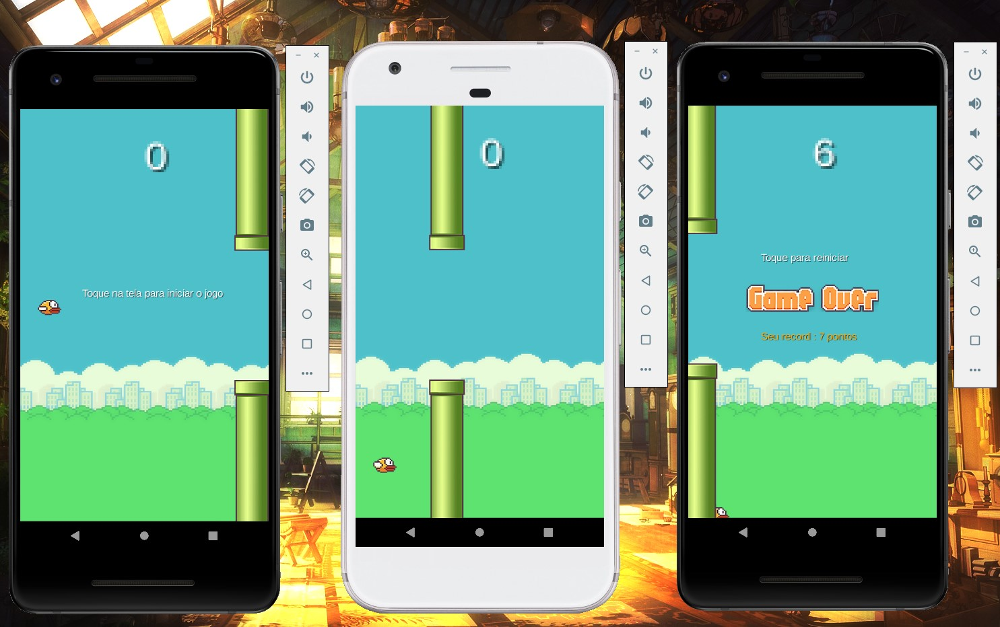

# Flappy Bird Clone

A basic Flappy Bird Clone project with LibGDX Library.
### Developers: 
* [Marcos Vinicius Ferreira](https://github.com/marcosnaofazisso) 

## Goals and Rules:
The main goals of Flappy Bird Clone project on Android development was to understand the mechanics of developing a game with LibGDX Library, your functionalities, graphics, sprites and  methods. It was very fun!

# Demo

Images of some game mechanics like gravity, colision and moviments.

# Tutorial
Recommended build tools and SDK versions:

Android Studio IDE: Eletric Eel 
Compile SDK Version 33
Min SDK Version 14
Target SDK Version 33

    Get JAR file from official LibGDX library website: https://libgdx.com

## Thank you!

